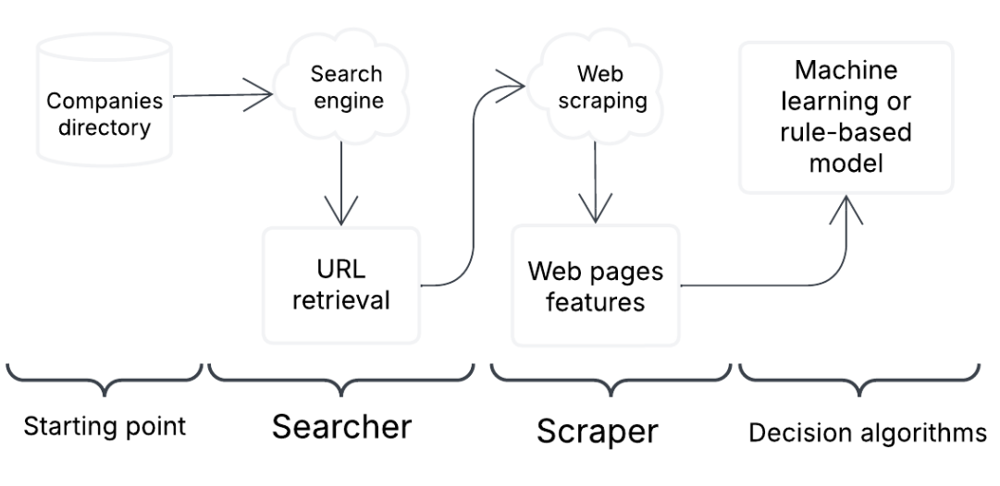

# URL Finding

*Extracting Company Websites Using Web Search and Web Data*

## Introduction

This repository contains the code and resources to build a URL finding system, which aims to automatically identify the official websites of companies based on various input signals (e.g. company name, address, NIF). The approach combines structured company datasets with search engine queries, web scraping, matching logic and machine learning models to retrieve and validate URLs.

Having access to a company's official website is key for economic and statistical research, business intelligence and monitoring firm dynamics. However, many firms are not directly linked to a known URL in business registers or official datasets, which motivates the need for automated URL identification systems.

## Project structure


    Directory structure:
    └── huella-digital-y-econonia-urlfinding/
        ├── README.md
        ├── requirements.txt
        ├── docs/
        ├── figures/
        └── src/
            ├── 2_first_searcher.ipynb
            ├── 3_scraper.ipynb
            ├── 5_classification.ipynb
            ├── quickstart.py
            └── 3_crawler/


## Get started

In short the software operates as follows:
- Uses a search engine (Google API in this case) to collect candidate websites.
- Scrapes the websites to enrich the results with additional content.
- Applies regular expressions to extract relevant identifying information.
- Uses linkage rules and machine learning models to match the correct URL to each company.

This process model is shown in the figure below:

<p align="center">
  
</p>


Use the following commands to install urlfinding from your anaconda prompt:


```bash
git clone https://github.com/Huella-Digital-y-Econonia/urlfinding.git # or download and unzip this repository
cd urlfinding
pip install -r requirements.txt
```

### Searcher

This software uses the *[Google custom search JSON API](https://developers.google.com/custom-search)* which offers 100 search queries per day for free. Use the paid version if you need more.

To get started configure a custom search engine and get your API key from [here](https://developers.google.com/custom-search/v1/overview). Then add the API key and the search engine ID to the `config.yml`.

### Scraper


### Matching


### Linking
